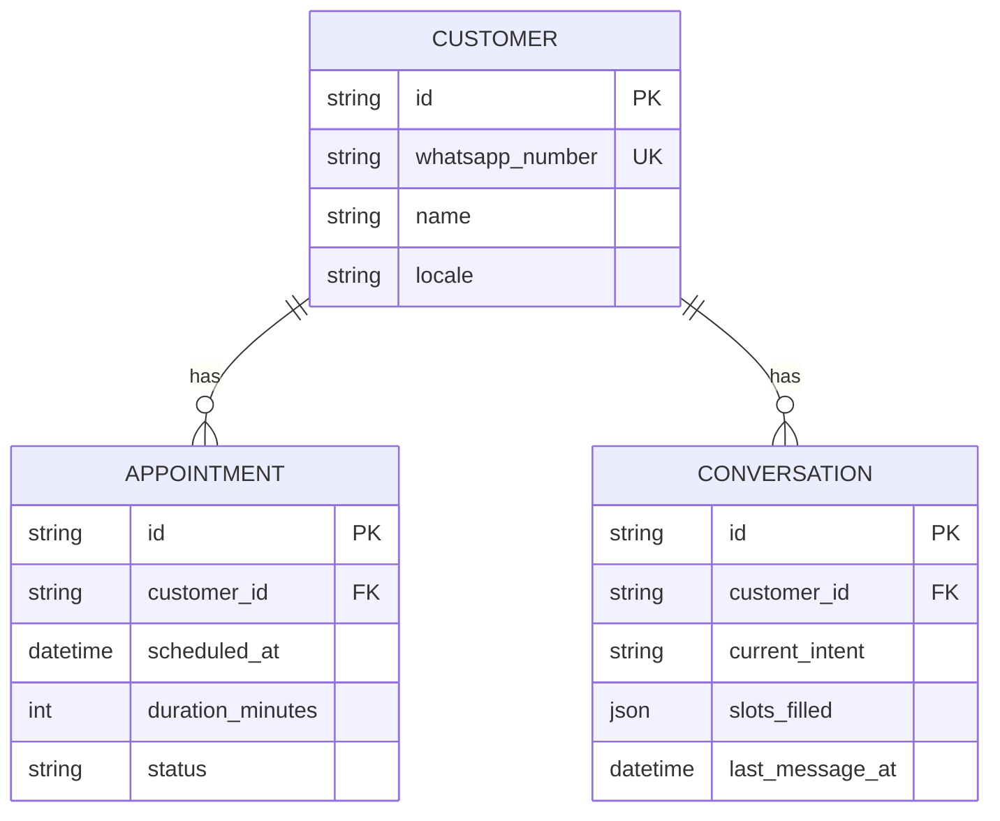

# Data Model

## Entities

### Customer

A WhatsApp user known to the bot. The unique business key is the WhatsApp
phone number in E.164 format (e.g. `+5215551234567`).

| Field             | Type       | Notes                                |
| ----------------- | ---------- | ------------------------------------ |
| `id`              | UUID v4    | Primary key (string, 36 chars)       |
| `whatsapp_number` | string(32) | Unique, indexed                      |
| `name`            | string?    | Optional display name                |
| `locale`          | string(10) | BCP-47 (default `es-MX`)             |
| `notes`           | string?    | Free-form internal notes (max 500)   |
| `created_at`      | datetime   | UTC                                  |
| `updated_at`      | datetime   | UTC, auto-touch on update            |

### Appointment

A booking made by a customer for a future date+time.

| Field              | Type             | Notes                              |
| ------------------ | ---------------- | ---------------------------------- |
| `id`               | UUID v4          | Primary key                        |
| `customer_id`      | UUID v4          | FK -> customers, ON DELETE CASCADE |
| `scheduled_at`     | datetime (UTC)   | Indexed                            |
| `duration_minutes` | int              | Default 30, range 5-480            |
| `status`           | StrEnum          | scheduled / confirmed / cancelled / completed / no_show |
| `notes`            | string?          | Max 500                            |
| `created_at`       | datetime (UTC)   |                                    |
| `updated_at`       | datetime (UTC)   |                                    |

### Conversation

State machine context for an ongoing customer dialog.

| Field             | Type           | Notes                                              |
| ----------------- | -------------- | -------------------------------------------------- |
| `id`              | UUID v4        | Primary key                                        |
| `customer_id`     | UUID v4        | FK -> customers                                    |
| `current_intent`  | string?        | LLM-classified intent (e.g. `book_appointment`)    |
| `slots_filled`    | JSON           | Dict of slot name -> value, accumulated mid-flow   |
| `last_message_at` | datetime (UTC) | Used to expire idle conversations                  |
| `created_at`      | datetime (UTC) |                                                    |
| `updated_at`      | datetime (UTC) |                                                    |

## Diagram



## Conventions

- All `datetime` columns are stored in UTC. Convert to `BUSINESS_TIMEZONE` only
  at presentation boundaries.
- Primary keys are UUID v4 strings (36 chars). Forks that need higher
  performance can switch to `BINARY(16)` storage.
- `Conversation.slots_filled` uses SQLite's JSON1 extension. If you need to
  query specific slots frequently, add a generated column.
- `ON DELETE CASCADE` keeps appointments and conversations consistent when a
  customer is removed.

## Migrations

Tracked in `alembic/versions/`. Generate a new migration after editing models:

```bash
make migrate-revision M="add foo column to bar"
```

Review the generated script before committing — autogenerate misses renames.

Apply pending migrations:

```bash
make migrate
```

The first migration (`0001_initial.py`) creates all three tables and their
indexes.
